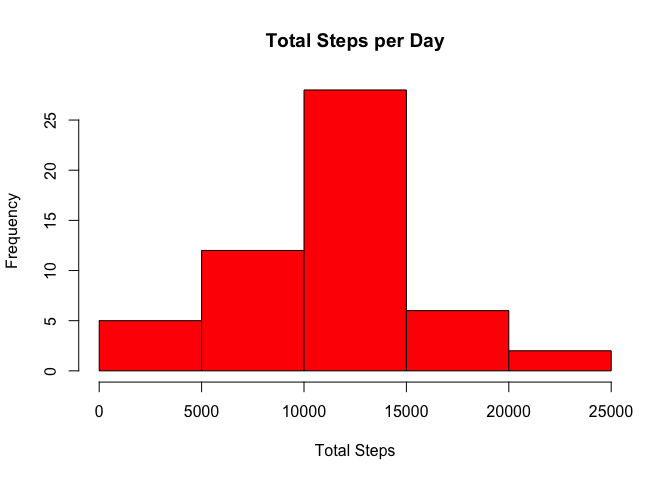
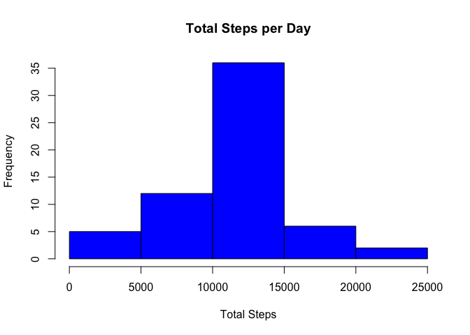

# Reproducible Research: Peer Assessment 1


## Loading and preprocessing the data

```r
library(data.table)
data <- read.table("activity.csv", header=T, sep=",")
```

## What is mean total number of steps taken per day?

```r
library(sqldf) ### SQL package based on SQLite
```

```
## Loading required package: gsubfn
```

```
## Loading required package: proto
```

```
## Warning in doTryCatch(return(expr), name, parentenv, handler): unable to load shared object '/Library/Frameworks/R.framework/Resources/modules//R_X11.so':
##   dlopen(/Library/Frameworks/R.framework/Resources/modules//R_X11.so, 6): Library not loaded: /opt/X11/lib/libSM.6.dylib
##   Referenced from: /Library/Frameworks/R.framework/Resources/modules//R_X11.so
##   Reason: image not found
```

```
## Could not load tcltk.  Will use slower R code instead.
```

```
## Loading required package: RSQLite
```

```
## Loading required package: DBI
```

```r
# Make a histogram of the total number of steps taken each day
data1 <- sqldf("select date,sum(steps) as total_steps from data where steps is not null group by 1")
hist(data1$total_steps, col="red", xlab="Total Steps", main="Total Steps per Day")
```



```r
# Calculate and report the mean and median total number of steps taken per day
MeanSteps <- mean(data1$total_steps)
print(MeanSteps)
```

```
## [1] 10766.19
```

```r
MedianSteps <- median(data1$total_steps)
print(MedianSteps)
```

```
## [1] 10765
```
## What is the average daily activity pattern?

```r
# Make a time series plot (i.e. type = "l") of the 5-minute interval (x-axis) and the average number of steps taken, averaged across all days (y-axis)
data2 <- sqldf("select interval as intervalKey, avg(steps) as averageSteps from data where steps is not null group by 1")
library(ggplot2)
ggplot(data2, aes(x=intervalKey)) + geom_line(aes(y=averageSteps)) + labs(y="Average # of Steps", x="Interval") + ggtitle("Avg. Daily Steps")
```


```r
# Which 5-minute interval, on average across all the days in the dataset, contains the maximum number of steps?
## first we find the max value
maxSteps <- max(data2$averageSteps)
## then the max interval
maxInterval <- data2[data2$averageSteps == maxSteps,]
print(maxInterval$interval)
```

```
## [1] 835
```
## Imputing missing values

```r
# Calculate and report the total number of missing values in the dataset (i.e. the total number of rows with NAs)
missing_values <- sqldf("select count(*) as steps from data where steps is null")
print (missing_values)
```

```
##   steps
## 1  2304
```

```r
# Devise a strategy for filling in all of the missing values in the dataset. The strategy does not need to be sophisticated. For example, you could use the mean/median for that day, or the mean for that 5-minute interval, etc. and Create a new dataset that is equal to the original dataset but with the missing data filled in.
data$steps <- as.numeric(data$steps) # I had to change the datatype to numeric
data3 <- sqldf("select data.date,data.interval, case when steps is null then averageSteps else steps end as steps from data inner join data2 on data.interval=data2.intervalKey")
# Make a histogram of the total number of steps taken each day
data4 <- sqldf("select date,sum(steps) as totalSteps from data3 where steps is not null group by 1")
hist(data4$totalSteps, col="blue", xlab="Total Steps", main="Total Steps per Day")
```



```r
# and Calculate and report the mean and median total number of steps taken per day
meanSteps_new <- mean(data4$totalSteps)
print(meanSteps_new)
```

```
## [1] 10766.19
```

```r
medianSteps_new <- median(data4$totalSteps)
print(medianSteps_new)
```

```
## [1] 10766.19
```
Q: What is the impact of imputing missing data on the estimates of the total daily number of steps?

A: mean stays the same and median increases by one.

## Are there differences in activity patterns between weekdays and weekends?

```r
#Create a new factor variable in the dataset with two levels -- "weekday" and "weekend" indicating whether a given date is a weekday or weekend day.
data5 <- sqldf("select case when strftime('%w', date) in ('0','6') then 'WeekEnd' else 'WeekDay' end as dayType, interval, avg(steps) as avgSteps from data3 group by 1,2") # using strftime with %w for day of week (0 is Sunday 1 is Monday)
# Make a panel plot containing a time series plot of the 5-minute interval (x-axis) and the average number of steps taken, averaged across all weekday days or weekend days (y-axis)
ggplot(data5, aes(x=interval)) + geom_line(aes(y=avgSteps), col="blue") + facet_wrap(~dayType, ncol=1) +
labs(y="Average # of Steps", x="Interval")
```


```text
* All figures are also available in figuers directory
```


